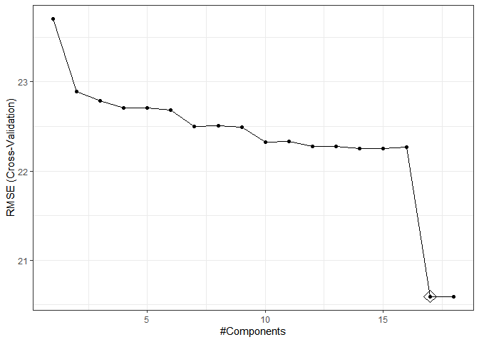
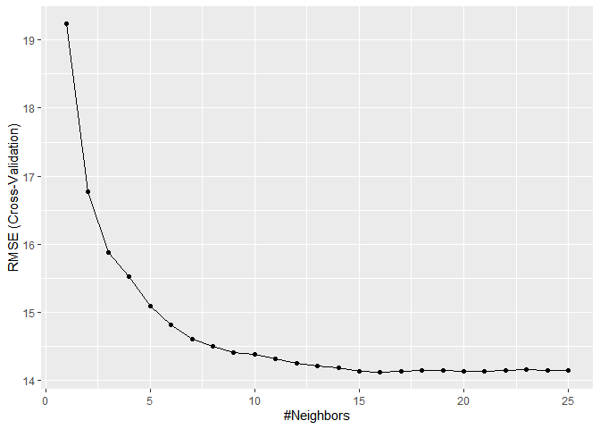

p8106 midterm
================
Mirah
2024-03-27

# Midterm Project

### background

To gain a better understanding of the factors that predict recovery time
from COVID-19 illness, a study was designed to combine three existing
cohort studies that have been tracking participants for several years.
The study collects recovery information through questionnaires and
medical records, and leverages existing data on personal characteristics
prior to the pandemic. The ultimate goal is to develop a prediction
model for recovery time and identify important risk factors for long
recovery time.

``` r
#loading data set

load("Data/recovery.RData")

dat = dat %>% drop_na() %>% janitor::clean_names() %>% select(-id)
```

\##Exploratory Analysis

``` r
#matrix of predictors, no recovery time
x_ea = model.matrix(recovery_time ~., dat)[, -1]
#vector of responses
y_ea = dat$recovery_time

theme1 <- trellis.par.get()
theme1$plot.symbol$col <- rgb(.2, .4, .2, .5)
theme1$plot.symbol$pch <- 16
theme1$plot.line$col <- rgb(.8, .1, .1, 1)
theme1$plot.line$lwd <- 2
theme1$strip.background$col <- rgb(.0, .2, .6, .2)
trellis.par.set(theme1)

featurePlot(x_ea[, -c(2,3,4,5,6,7,11,12,15,16,17)], y_ea, plot="scatter", labels = c("", "Y"),type = c("p", "smooth"), layout = c(3,2))
```

<!-- -->

``` r
correlation = corrplot(cor(x_ea[, -c(2,3,4,5,6,7,11,12,15,16,17)],y_ea))
```

<!-- -->

``` r
#correlation values and scatter plots show no linear correlations with the nummeric variables

#checking to see if predictors correlate
corrplot(cor(x_ea[, -c(2,3,4,5,6,7,11,12,15,16,17)]), type = "full", diag= FALSE)
```

<!-- -->

``` r
#maybe add non parametric correlation test

#check for normal distributions of numeric variables to see if transformationa are necessary
```

\##Model training

``` r
#splitting data into training and testing 
set.seed(2)

#data partition
data_split = initial_split(data = dat, prop = .8)
training_data = training(data_split)
test_data = testing(data_split)
```

``` r
#training data

#matrix of predictors, no recovery time
x_training = model.matrix(recovery_time ~., training_data)[, -1]
#vector of responses
y_training = training_data$recovery_time

#testing data

#matrix of predictors, no recovery time
x_testing = model.matrix(recovery_time ~., test_data)[, -1]
#vector of responses
y_testing = test_data$recovery_time
```

``` r
#using caret

#knn
control = trainControl(method= "cv", number = 10)


fit.knn = train(x_training, y_training,
                method = "knn",
                trControl = control,
                tuneGrid = expand.grid(k=seq(from =1, to = 25, by = 1)))

ggplot(fit.knn)
```

<!-- -->

``` r
#k=14
```

``` r
#linear model
fit.lm = train(x_training, y_training,
               data = training_data,
               trControl = control)
```

How do you choose a lambda

``` r
#ridge regression

ridge.fit <- train(x_training,y_training,
                   data = training_data,
                   trControl = control,
                   method = "glmnet",
                   tuneGrid = expand.grid(alpha = 0,
                                          lambda = exp(seq(10, -5, length=100))))

plot(ridge.fit, xTrans = log)
```

<!-- -->

``` r
#best lambda
ridge.fit$bestTune
```

    ##    alpha    lambda
    ## 30     0 0.5454956

``` r
#Coefficients in final model
coef(ridge.fit$finalModel, s = ridge.fit$bestTune$lambda)
```

    ## 18 x 1 sparse Matrix of class "dgCMatrix"
    ##                         s1
    ## (Intercept)  -117.01411494
    ## age             0.19251501
    ## gender         -2.48566998
    ## race2           2.10893672
    ## race3          -1.55369621
    ## race4          -0.65563498
    ## smoking1        2.42795618
    ## smoking2        2.89381550
    ## height          0.52869977
    ## weight         -0.89924951
    ## bmi             4.44256063
    ## hypertension    2.31676844
    ## diabetes       -2.04500225
    ## sbp             0.08663018
    ## ldl            -0.03359715
    ## vaccine        -6.87690608
    ## severity        8.27607544
    ## studyB          5.74811996

``` r
ridge.pred = predict(ridge.fit, newdata = model.matrix(recovery_time ~ .,test_data)[,-1])

# test error
mean((ridge.pred - test_data[, "recovery_time"])^2)
```

    ## [1] 336.6451

Dimension reduction

``` r
#PCR
set.seed(2)
pcr.fit <- train(x_training, y_training,
                 method = "pcr",
                 tuneGrid = data.frame(ncomp = 1:18),
                 trControl = control,
                 preProcess = c("center", "scale"))

predy2.pcr2 <- predict(pcr.fit, newdata = x_testing)

mean((y_testing - predy2.pcr2)^2)
```

    ## [1] 327.5411

``` r
ggplot(pcr.fit, highlight = TRUE) + theme_bw()
```

<!-- -->

``` r
#PLS
set.seed(2)
pls.fit <- train(x_training, y_training,
                 method = "pls",
                 tuneGrid = data.frame(ncomp = 1:18),
                 trControl = control,
                 preProcess = c("center", "scale"))

predy2.pls2 <- predict(pls.fit, newdata = x_testing)

mean((y_testing - predy2.pls2)^2)
```

    ## [1] 327.5415

``` r
ggplot(pls.fit, highlight = TRUE)
```

<!-- -->

``` r
#elastic net
enet.fit = train(x_training, y_training,
                 method = "glmnet",
                 tuneGrid = expand.grid(alpha = seq(0, 1,length = 21),
                                        lambda = exp(seq(6, 0, length = 100))),
                 trControl = control)
```

``` r
#polynomial regression

#GAM

gam.fit = train(x_training, y_training,
                 method = "gam",
                 tuneGrid = data.frame(method = "GCV.Cp", select = c(TRUE,FALSE)),
                trControl = control)

gam.fit$bestTune
```

    ##   select method
    ## 2   TRUE GCV.Cp

``` r
gam.fit$finalModel
```

    ## 
    ## Family: gaussian 
    ## Link function: identity 
    ## 
    ## Formula:
    ## .outcome ~ gender + race2 + race3 + race4 + smoking1 + smoking2 + 
    ##     hypertension + diabetes + vaccine + severity + studyB + s(age) + 
    ##     s(sbp) + s(ldl) + s(bmi) + s(height) + s(weight)
    ## 
    ## Estimated degrees of freedom:
    ## 4.158 0.666 0.707 8.469 6.885 4.756  total = 37.64 
    ## 
    ## GCV score: 375.8321

``` r
#MARS
mars_grid <- expand.grid(degree = 1:3,
nprune = 2:15)

set.seed(2)
mars.fit <- train(x_training, y_training,
                  method = "earth",
                  tuneGrid = mars_grid,
                  trControl = control)

ggplot(mars.fit)
```

<!-- -->

``` r
mars.fit$bestTune
```

    ##    nprune degree
    ## 23     10      2

``` r
coef(mars.fit$finalModel)
```

    ##                  (Intercept)                  h(30.9-bmi) 
    ##                   6.51654183                   5.53187539 
    ##         h(bmi-30.9) * studyB                  h(bmi-24.5) 
    ##                  25.13856093                   6.53517256 
    ##  h(159-height) * h(bmi-30.9)                      vaccine 
    ##                   2.80092090                  -6.33229592 
    ##       h(bmi-24.5) * severity h(85.1-weight) * h(bmi-30.9) 
    ##                   1.90821516                  -2.30816744 
    ##     h(bmi-24.5) * h(141-sbp)                       gender 
    ##                  -0.04938955                  -3.34199172

``` r
#which is better
rs = resamples(list(knn = fit.knn,lm = fit.lm, elastic_net = enet.fit, mars = mars.fit, gam = gam.fit,pcr=pcr.fit, pls=pls.fit))

summary(rs, metric = "RMSE")
```

    ## 
    ## Call:
    ## summary.resamples(object = rs, metric = "RMSE")
    ## 
    ## Models: knn, lm, elastic_net, mars, gam, pcr, pls 
    ## Number of resamples: 10 
    ## 
    ## RMSE 
    ##                 Min.  1st Qu.   Median     Mean  3rd Qu.     Max. NA's
    ## knn         14.97719 17.25550 21.58610 21.61772 24.67320 29.21964    0
    ## lm          15.78756 17.07752 17.64540 18.20671 19.09322 21.80847    0
    ## elastic_net 18.29955 19.41972 20.30866 21.86856 20.67746 36.06291    0
    ## mars        14.86430 15.73262 17.02050 17.69797 19.78862 21.70543    0
    ## gam         15.53472 18.46008 19.89294 20.29125 21.21857 25.92811    0
    ## pcr         16.45215 17.91897 21.01357 20.59555 22.34488 25.17761    0
    ## pls         16.45213 17.91897 21.01358 20.59555 22.34487 25.17760    0

``` r
bwplot(rs, metric = "RMSE")
```

<!-- -->
